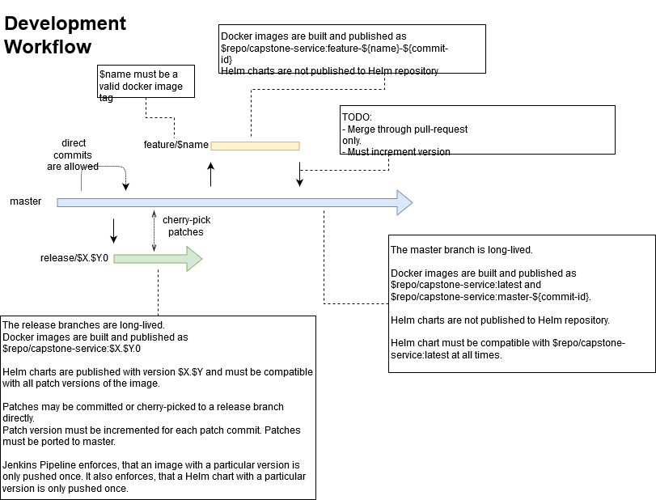

# Repository Overview

This is the service repository for the [Udacity Cloud DevOps Nano Degree](https://www.udacity.com/course/cloud-dev-ops-nanodegree--nd9991).
It contains a toy micro-service built using Quarkus for the final (capstone) project.
It also contains the Jenkinsfile for building the service.

There are three other repositories 
* [DevOps_Capstone](https://github.com/FlorianSeidel/DevOps_Capstone):  Main repository. Setup and high-level documentation
* [DevOps_Capstone_Service](https://github.com/FlorianSeidel/DevOps_Capstone_Deployment): Contains the Flux deployment config
* [DevOps_Capstone_Repo](https://github.com/FlorianSeidel/DevOps_Capstone_Repo): Helm Repository for the project

# Development workflow

This is a variant of trunk based development.

